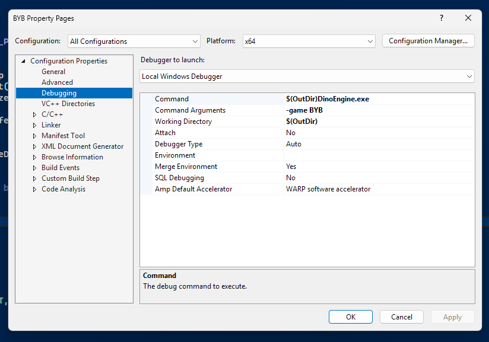

# HOW TO BUILD
Windows only lol.

Step 1: Open Visual Studio project.

Step 2: Select the game project (BYB in this case).

Step 3: Right click and open properties.

Step 4: Change the debugging properties to run \$(OutDir)DinoEngine.exe, set the args to -game \[Game Name],  
and set working directory to \$(OutDir)

This is needed because the game project is actually just a DLL dynamically loaded by the engine. So to debug the game, you need to essentially debug the engine. Assets are copied to the out dir, so use that as the working directory.
